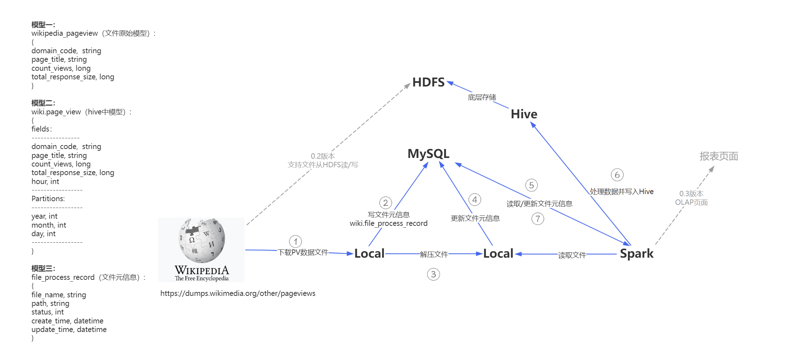

# wiki_pv_2hive

这是一个练手项目，目的是熟悉如何使用spark和hive处理、保存和分析离线数据。

## 数据

- wikipedia公开的页面浏览记录： 
  https://dumps.wikimedia.org/other/pageviews
- 浏览记录模型定义： 
  https://wikitech.wikimedia.org/wiki/Analytics/Data_Lake/Traffic/Pageviews

## 处理思路

## Features

- 自动获取文件链接
- 自动识别未下载过的文件
- 自动识别需要解压的下载文件
- spark能自动识别未处理的文件
- Hive分区表按年、月、日进行分区，支持多时间维度的分析

## 版本规划

- 0.1 支持在开发者本地按月进行的的离线数据自动化处理与分析 （当前）
- 0.2 支持在Spark + Hive + HDFS的分布式环境中，按月进行的的离线数据自动化处理与分析
- 0.3 支持OLAP分析的页面（仿pageviews.wmcloud.org），以及基于Web页面的下载与处理任务调度
- 0.4 支持基于Wikipedia的API进行实时数据处理与分析（有可能是另一个项目）

## 使用方法

### 运行环境

我本地的环境，仅供参考

- JDK 1.8
- MySQL 8.0.32
- Spark 3.3.2
- Scala 2.12.15
- Hadoop 3.3.0
- Hive 3.1.3

### 修改配置
- /java/src/main/resource 
    此目录下db.properties中是MySQL的相关配置
- /spark/src/main/resource 
    此目录下是spark使用的相关配置文件，db.properties中是MySQL的相关配置，其余是spark常见的配置文件，根据开发环境自行配置

### 下载page_view文件
执行/java/src/main/java/com/wbx/wiki/WikiPageViewFileDownloader.java中的main方法。
 
如果要修改想要下载的page_view文件的月份或年份，可以修改/java/src/main/java/com/wbx/constant/Constants.java文件中的“YEAR”和“MONTH”的值。
一个月的原始压缩文件大概40G，解压缩后140G。

### ETL与写入Hive
执行/spark/src/main/scala/DailyPageView2Hive.scala的main方法。

 
Copyright (C) 2023 Ben Wang
